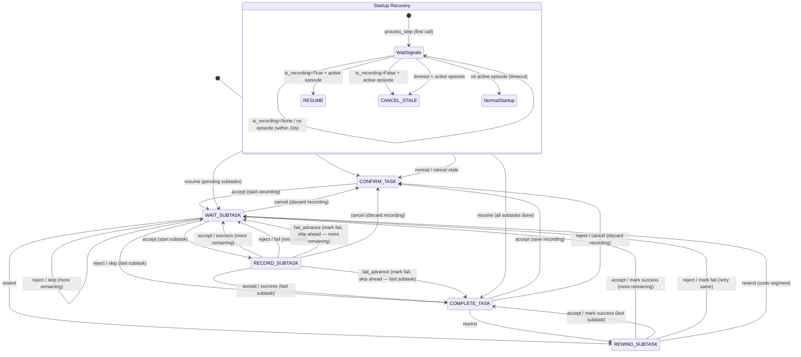

# Yubi Core

[](https://opensource.org/licenses/Apache-2.0)
[](https://www.python.org/downloads/)
[](https://docs.ros.org/)

ROS 2 data collection system for recording, uploading, and managing robot teleoperation episodes.

## Dependencies

- docker
- docker compose

## Initial Setup

1. Clone the repository

   ```bash
   git clone https://github.com/airoa-org/yubi-core.git
   ```

2. Build Docker image
   ```bash
   cd yubi-core
   docker compose build --build-arg GIT_HASH=$(git rev-parse HEAD) --build-arg GIT_BRANCH=$(git rev-parse --abbrev-ref HEAD)
   ```

## Data Collection

### Configuration

All configuration lives in `yubi-core/config/`. Copy each `*.sample` file to
the name without the suffix and edit it. `qos_overrides.yaml` ships without a
`.sample` suffix — edit it in place.

| File | What it configures |
|------|--------------------|
| `robot_config.yaml` | Node parameters: robot identity, topics to record, backend API, upload/gate toggles, deployment metadata. Passed to every node. |
| `upload_targets.yaml` | S3-compatible upload target(s), credentials, retention, and garbage collection. |
| `recording_gate.yaml` | Opt-in safety/health gate conditions. |
| `qos_overrides.yaml` | Per-topic QoS overrides for `ros2 bag record` (for BEST_EFFORT publishers). |
| `task_file.yaml` | Offline task definitions (only when `offline_mode: true`). |

**Quick start:** copy `robot_config.yaml.sample` → `robot_config.yaml`, set
`record_topics` and either `base_url`/`api_key` (online) or
`offline_mode: true` + `task_file` (offline), then launch. Leave `robot_type`
and `runner_organization` as `"FIXME"` to auto-resolve them from the backend.

See **[docs/configuration.md](docs/configuration.md)** for the full reference
(every parameter, upload targets, gate conditions, launch args, env vars).

### Data Collection with Leader-Follower Device

#### Startup

**Environment variables** (set in `.env`; see `.env.example`). These configure
Docker Compose and the ROS middleware — backend/S3 settings are **not** env
vars, they live in `robot_config.yaml` / `upload_targets.yaml`.

| Variable | Description | Default |
|----------|-------------|---------|
| `ROS_DOMAIN_ID` | ROS 2 domain ID | `0` |
| `DATA_MOUNT_PATH` | Host path mounted to `/opt/data` for recordings | _(required)_ |
| `MINIO_ROOT_USER` / `MINIO_ROOT_PASSWORD` | Credentials for the bundled MinIO service | `minioadmin` |
| `SENTRY_DSN` | Sentry DSN for error tracking (empty = disabled) | _(empty)_ |
| `WEB_VIDEO_SERVER_PORT` | Port for the web video server | `9091` |
| `RMW_IMPLEMENTATION` | ROS 2 RMW (`rmw_fastrtps_cpp` for FastDDS) | `rmw_cyclonedds_cpp` |
| `FASTDDS_PROFILE_HOST_PATH` | Host path to FastDDS profile XML | `./docker/fastdds_profile.xml` |

See [docs/configuration.md](docs/configuration.md#environment-variables) for the full list.

Start the docker container if not already running:
```bash
export ROS_DOMAIN_ID=XX
docker compose up -d
```

Enter the docker container:
```bash
docker compose exec yubi-core bash
```

Run the scripts:
```bash
colcon build --symlink-install --cmake-args -DCMAKE_BUILD_TYPE=Release
source install/setup.bash
ros2 launch yubi_core leader_teleop.launch.py
```

#### Launch Arguments

The launch file declares three arguments. Everything else (API endpoint, S3,
gate toggle, …) is a parameter inside `robot_config.yaml`.

| Argument | Default | Description |
|----------|---------|-------------|
| `robot_config` | `<package_share>/config/robot_config.yaml` | Path to the robot configuration YAML |
| `qos_overrides_file` | `<package_share>/config/qos_overrides.yaml` | Path to QoS overrides file |
| `bridge_mode` | `false` | Skip `task_receiver` so an external node provides tasks |

#### Usage Examples

```bash
# Default config
ros2 launch yubi_core leader_teleop.launch.py

# Custom robot config (set base_url, api_key, etc. inside this file)
ros2 launch yubi_core leader_teleop.launch.py robot_config:=/path/to/robot_config.yaml

# Custom QoS overrides
ros2 launch yubi_core leader_teleop.launch.py qos_overrides_file:=/path/to/qos.yaml
```

You can monitor the current task progress via the following topic:

```bash
ros2 topic echo /task_sequence_manager/status
---
data: received_task:Pick-and-Place Demo
---
data: "next subtask:Approach. \n wait for start or skip command."
---
data: "next subtask:Pick. \n wait for start or skip command."
---
data: "completed_task:Pick-and-Place Demo. \n wait for save or discard command."
```

You can also check the current metadata JSON via:

```bash
ros2 topic echo /metadata_handler/metadata_json
```

#### Storage and Retention

Local recording directories use the format `{timestamp}-{episodeId}` (e.g. `26-03-28-14-30-45-ep-task-1`).

Upload, retention, and garbage collection are configured in
`upload_targets.yaml` (each target supports a `path_rule` — `"flat"`, the
default using the directory name, or `"canonical"`, a metadata-derived
`org=.../site=.../uuid=...` hierarchy). See
[docs/configuration.md](docs/configuration.md#upload_targetsyaml) and
`upload_targets.yaml.sample`.

Key parameters:

| Parameter | File | Default | Description |
|-----------|------|---------|-------------|
| `required_free_space` | `robot_config.yaml` | `50` | Minimum free disk (GB) to allow recording |
| `upload_enabled` | `robot_config.yaml` | `true` | Enable S3 upload |
| `delete_after_upload` | `upload_targets.yaml` | `false` | Remove local files immediately after upload |
| `local_retention_hours` | `upload_targets.yaml` | `24` | Hours to keep uploaded recordings locally |

Retention cleanup runs periodically:
- **Uploaded recordings** are removed after `local_retention_hours`.
- **Stale non-uploaded recordings** are removed after `2 x local_retention_hours`.
- Set `delete_after_upload: true` to skip retention and delete immediately.

#### Recording Gate

The recording gate blocks or cancels recording when safety/readiness conditions fail. It is **opt-in** — disabled by default.

Enable it by setting `use_recording_gate: true` and a `recording_gate_config` path in `robot_config.yaml`.

**Gate levels** (published on `~/gate_level` as `UInt8`):

| Level | Meaning |
|-------|---------|
| 0 | OK — recording allowed |
| 1 | Block — new episodes cannot start (in-progress episodes continue) |
| 2 | Hard-stop — active recordings are cancelled immediately |

**Condition types** (configured in the gate YAML referenced by `recording_gate_config`):

| Type | Description |
|------|-------------|
| `topic_condition` | All-in-one: presence, freshness, rate, and content expression |
| `diagnostics_error_rate` | Monitors a `DiagnosticArray` topic for error rate |
| `tf_availability` | Checks that a TF transform is available |

Each condition specifies an `escalation` level (1 or 2) and a `timeout_sec`. See [docs/configuration.md](docs/configuration.md#recording_gateyaml) and `recording_gate.yaml.sample`.

When recording is blocked or cancelled by the gate, the task sequence manager publishes:
- `/diagnostics` — `DiagnosticArray` with gate status
- `~/recording_block_reason` — human-readable reason string

#### Duration Limits

Duration enforcement is handled by the recording gate using `topic_condition` conditions with `timeout_sec: -1.0` (inactive-safe: no message = PASS). The task sequence manager publishes elapsed time on:
- `~/subtask_elapsed_sec` — seconds since subtask start (0.0 when not recording a subtask)
- `~/episode_elapsed_sec` — seconds since episode start (0.0 when no episode is active)

To enable duration limits, configure `topic_condition` conditions in the gate config (`recording_gate.yaml`). The sample includes a two-tier pattern (disabled by default):
- **Warn** (escalation 1): blocks new episodes, publishes diagnostics
- **Hard-stop** (escalation 2): cancels active recording

Example (enable in `recording_gate.yaml`):
```yaml
  subtask_duration_warn:
    type: topic_condition
    enabled: true           # ← enable
    escalation: 1
    topic: /task_sequence_manager/subtask_elapsed_sec
    condition: "msg.data < 90.0"    # warn at 90s
    timeout_sec: -1.0

  subtask_duration_limit:
    type: topic_condition
    enabled: true           # ← enable
    escalation: 2
    topic: /task_sequence_manager/subtask_elapsed_sec
    condition: "msg.data < 120.0"   # stop at 120s
    timeout_sec: -1.0
```

#### Error Tracking (Sentry)

All ROS2 nodes integrate optional [Sentry](https://sentry.io/) error tracking for unhandled exceptions. To enable it, set the `SENTRY_DSN` environment variable to your Sentry project DSN.

When `SENTRY_DSN` is unset or empty, Sentry is completely disabled (no-op). The `sentry-sdk` package is included in the Docker image but is an optional dependency for local development (`pip install .[sentry]`).

Sentry events are tagged with:
- `environment` — from the `ENV` variable (default: `development`)
- `release` — from the `GIT_HASH` build arg

#### Task Execution

Tasks can be executed using the following services (same as [hsr_data_collection](https://github.com/airoa-org/hsr_data_collection)):
- `/data_collection/accept` (`Trigger`)
- `/data_collection/reject` (`Trigger`)
- `/data_collection/cancel_episode` (`Trigger`) — cancel episode with default reason
- `/data_collection/cancel_episode_with_reason` (`StringTrigger`) — cancel with custom reason via `message` field
- `/data_collection/rewind` (`Trigger`)
- `/data_collection/repeat` (`Trigger`) — repeat the last completed episode

#### Joystick Control with task_command_dispatch_node

The `task_command_dispatch_node` allows controlling data collection via joystick buttons by mapping button presses to service calls. It is **not** started by `leader_teleop.launch.py` — run it separately when you want joystick control.

**Startup:**
```bash
ros2 run yubi_core task_command_dispatch_node
```

**Default Button Mapping:**

| Button | Service | Action |
|--------|---------|--------|
| 0 | `/data_collection/cancel_episode` | Cancel current episode |
| 1 | `/data_collection/rewind` | Rewind task |
| 2 | `/data_collection/accept` | Accept/start task or subtask |
| 3 | `/data_collection/reject` | Reject/fail task or subtask |

**Parameters:**

| Parameter | Default | Description |
|-----------|---------|-------------|
| `button_check_interval` | `0.05` | Polling interval (seconds) |
| `debounce_sec` | `0.25` | Debounce time to prevent double triggers |
| `joy_accept_button` | `2` | Button index for accept |
| `joy_reject_button` | `3` | Button index for reject |
| `joy_cancel_episode_button` | `0` | Button index for cancel episode |
| `joy_rewind_button` | `1` | Button index for rewind |

**Example with custom button mapping:**
```bash
ros2 run yubi_core task_command_dispatch_node --ros-args \
  -p joy_accept_button:=4 \
  -p joy_reject_button:=5
```

#### Task State Transition Diagram



State descriptions:
- **CONFIRM_TASK** — idle, waiting for an episode to start
- **WAIT_SUBTASK** — recording active, waiting to start or skip the next subtask
- **RECORD_SUBTASK** — subtask in progress, waiting for success/fail
- **COMPLETE_TASK** — all subtasks resolved, waiting to save or discard
- **REWIND_SUBTASK** — reviewing the last subtask result

Operator commands map to services under `/data_collection/` (`accept`,
`reject`, `cancel_episode_with_reason`, `rewind`, `fail_advance`). The
`fail_advance` command marks the current subtask failed and advances to the
next one without retrying.

On startup, a one-time recovery check detects in-progress episodes
from a previous run and either resumes or cancels them (see Startup Recovery in the diagram).

In addition to the operator commands above, the recording gate can
automatically issue a cancel (→ CONFIRM_TASK) from WAIT_SUBTASK,
RECORD_SUBTASK, or COMPLETE_TASK when it escalates to a hard-stop.

### Testing

```bash
# Unit tests (no external dependencies)
make test          # ROS node tests (mocked ROS stack)
make test-gc       # S3 GC tests (mocked S3)

# Integration tests (requires Docker)
make test-integration   # run all integration tests (storage + gate)

# Or run individually:
make test-storage       # S3 storage tests (starts MinIO, runs, cleans up)
make test-gate          # ROS2 gate tests (builds image, runs, cleans up)
```

See [docs/testing.md](docs/testing.md) for full details on test architecture,
integration test coverage, and the ROS/logic separation design.

### DDS Middleware

This configuration supports both CycloneDDS (default) and FastDDS middleware. To use FastDDS, set `RMW_IMPLEMENTATION=rmw_fastrtps_cpp` in your `.env` file and provide the FastDDS profile path via `FASTDDS_PROFILE_HOST_PATH`.

#### DDS Middleware Selection

The `ros_entrypoint.sh` supports switching between CycloneDDS and FastDDS:

| `RMW_IMPLEMENTATION` value | Middleware | Config file |
|---|---|---|
| `rmw_cyclonedds_cpp` (default) | CycloneDDS | `cyclonedds_profile.xml` |
| `rmw_fastrtps_cpp` | FastDDS | `fastdds_profile.xml` |

## Contributing

We welcome contributions! Whether you're fixing bugs, adding features, or
supporting new robot platforms, your help is appreciated. See
[CONTRIBUTING.md](CONTRIBUTING.md) for development setup and guidelines, and
our [Code of Conduct](CODE_OF_CONDUCT.md).

## Contributors

- Khrapchenkov Petr
- Takuya Okubo
- Jumpei Arima
- Naoaki Kanazawa
- Naruya Kondo

## License

This project is licensed under the Apache License 2.0 — see the [LICENSE](LICENSE) file for details.
