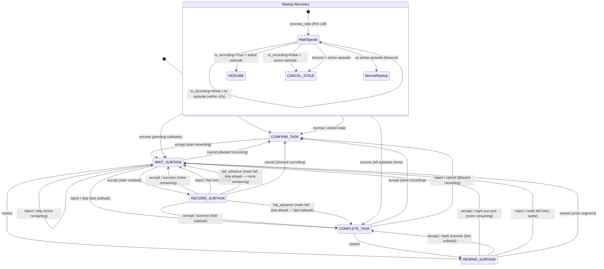

# Yubi Core

[](https://opensource.org/licenses/Apache-2.0)
[](https://www.python.org/downloads/)
[](https://docs.ros.org/)

ロボットの遠隔操作エピソードを記録・アップロード・管理する ROS 2 データ収集システム。

## 本コードの依存関係

- docker
- docker compose

## 初期設定

1. コードのダウンロード

   ```bash
   git clone https://github.com/airoa-org/yubi-core.git
   ```

2. Docker イメージのビルド
   ```bash
   cd yubi-core
   docker compose build --build-arg GIT_HASH=$(git rev-parse HEAD) --build-arg GIT_BRANCH=$(git rev-parse --abbrev-ref HEAD)
   ```

## データ収集

### 設定

すべての設定は `yubi-core/config/` にあります。各 `*.sample` ファイルをサフィックスなしの名前にコピーして編集してください（`qos_overrides.yaml` は `.sample` が付かず、そのまま編集します）:

| ファイル | 設定内容 |
|----------|----------|
| `robot_config.yaml` | ノードパラメータ: ロボット識別、録画トピック、バックエンドAPI、アップロード/ゲートの有効化、デプロイメタデータ。全ノードに渡されます。 |
| `upload_targets.yaml` | S3互換アップロードターゲット、認証情報、保持期間、ガベージコレクション。 |
| `recording_gate.yaml` | オプトインの安全性/ヘルスゲート条件。 |
| `qos_overrides.yaml` | `ros2 bag record` 用のトピック別QoSオーバーライド（BEST_EFFORTパブリッシャ向け）。 |
| `task_file.yaml` | オフラインタスク定義（`offline_mode: true` のときのみ）。 |

**クイックスタート:** `robot_config.yaml.sample` を `robot_config.yaml` にコピーし、`record_topics` と、`base_url`/`api_key`（オンライン）または `offline_mode: true` + `task_file`（オフライン）を設定して起動します。`robot_type` と `runner_organization` を `"FIXME"` のままにすると、バックエンドから自動解決されます。

完全なリファレンス（全パラメータ、アップロードターゲット、ゲート条件、Launch引数、環境変数）は **[docs/configuration.md](docs/configuration.md)** を参照してください。

### リーダフォロワーデバイスでのデータ収集

#### 起動方法

**環境変数** (`.env` に設定。`.env.example` 参照)。これらは Docker Compose と ROS ミドルウェアの設定です。バックエンド/S3 の設定は環境変数ではなく、`robot_config.yaml` / `upload_targets.yaml` にあります。

| 変数 | 説明 | デフォルト値 |
|------|------|-------------|
| `ROS_DOMAIN_ID` | ROS 2 ドメインID | `0` |
| `DATA_MOUNT_PATH` | 録画用にコンテナの `/opt/data` にマウントするホストパス | _(必須)_ |
| `MINIO_ROOT_USER` / `MINIO_ROOT_PASSWORD` | 同梱 MinIO サービスの認証情報 | `minioadmin` |
| `SENTRY_DSN` | Sentryエラートラッキング用DSN（空 = 無効） | _(空)_ |
| `WEB_VIDEO_SERVER_PORT` | Webビデオサーバーのポート | `9091` |
| `RMW_IMPLEMENTATION` | ROS 2 RMW（`rmw_fastrtps_cpp` でFastDDS） | `rmw_cyclonedds_cpp` |
| `FASTDDS_PROFILE_HOST_PATH` | FastDDSプロファイルXMLのホストパス | `./docker/fastdds_profile.xml` |

完全な一覧は [docs/configuration.md](docs/configuration.md#environment-variables) を参照してください。

docker containerを起動していない場合は起動
```bash
export ROS_DOMAIN_ID=XX
docker compose up -d
```

docker containerに入る
```bash
docker compose exec yubi-core bash
```

スクリプトを実行
```bash
colcon build --symlink-install --cmake-args -DCMAKE_BUILD_TYPE=Release
source install/setup.bash
ros2 launch yubi_core leader_teleop.launch.py
```

#### Launch引数

Launch ファイルが宣言する引数は3つです。それ以外（APIエンドポイント、S3、ゲートの有効化など）は `robot_config.yaml` 内のパラメータです。

| 引数 | デフォルト値 | 説明 |
|------|-------------|------|
| `robot_config` | `<package_share>/config/robot_config.yaml` | ロボット設定YAMLのパス |
| `qos_overrides_file` | `<package_share>/config/qos_overrides.yaml` | QoSオーバーライドファイルのパス |
| `bridge_mode` | `false` | `task_receiver` をスキップし、外部ノードがタスクを提供 |

#### 使用例

```bash
# デフォルト設定
ros2 launch yubi_core leader_teleop.launch.py

# カスタムロボット設定（base_url, api_key などはこのファイル内で設定）
ros2 launch yubi_core leader_teleop.launch.py robot_config:=/path/to/robot_config.yaml

# カスタムQoSオーバーライド
ros2 launch yubi_core leader_teleop.launch.py qos_overrides_file:=/path/to/qos.yaml
```

上記の実行により、以下のトピックにて現在のタスクの進行状況を確認できます。

```bash
ros2 topic echo /task_sequence_manager/status
---
data: received_task:Pick-and-Place Demo
---
data: "next subtask:Approach. \n wait for start or skip command."
---
data: "next subtask:Pick. \n wait for start or skip command."
---
data: "completed_task:Pick-and-Place Demo. \n wait for save or discard command."
```

また、現在のメタデータJSONは以下のトピックで確認できます。

```bash
ros2 topic echo /metadata_handler/metadata_json
```

#### ストレージと保持期間 (Storage and Retention)

ローカルの録画ディレクトリは `{timestamp}-{episodeId}` 形式です（例: `26-03-28-14-30-45-ep-task-1`）。

アップロード、保持期間、ガベージコレクションは `upload_targets.yaml` で設定します（各ターゲットは `path_rule` をサポート — デフォルトはディレクトリ名を使う `"flat"`、またはメタデータ由来の `org=.../site=.../uuid=...` 階層を使う `"canonical"`）。[docs/configuration.md](docs/configuration.md#upload_targetsyaml) と `upload_targets.yaml.sample` を参照してください。

主なパラメータ:

| パラメータ | ファイル | デフォルト | 説明 |
|-----------|---------|-----------|------|
| `required_free_space` | `robot_config.yaml` | `50` | 録画開始に必要な最小空きディスク (GB) |
| `upload_enabled` | `robot_config.yaml` | `true` | S3アップロードを有効化 |
| `delete_after_upload` | `upload_targets.yaml` | `false` | アップロード後すぐにローカルファイルを削除 |
| `local_retention_hours` | `upload_targets.yaml` | `24` | アップロード済み録画をローカルに保持する時間 |

保持期間のクリーンアップは定期的に実行されます:
- **アップロード済みの録画**は `local_retention_hours` 経過後に削除されます。
- **未アップロードの古い録画**は `2 x local_retention_hours` 経過後に削除されます。
- `delete_after_upload: true` を設定すると、保持をスキップして即座に削除します。

#### 録画ゲート (Recording Gate)

録画ゲートは、安全性・準備状態の条件が満たされない場合に録画をブロックまたはキャンセルします。デフォルトでは**無効**（オプトイン）です。

`robot_config.yaml` で `use_recording_gate: true` と `recording_gate_config` のパスを設定して有効化します。

**ゲートレベル**（`~/gate_level` に `UInt8` として配信）:

| レベル | 意味 |
|--------|------|
| 0 | OK — 録画許可 |
| 1 | ブロック — 新規エピソード開始不可（実行中のエピソードは継続） |
| 2 | ハードストップ — 実行中の録画を即座にキャンセル |

**条件タイプ**（`recording_gate_config` が指すゲートYAMLで設定）:

| タイプ | 説明 |
|--------|------|
| `topic_condition` | オールインワン: 存在確認、鮮度、レート、コンテンツ式チェック |
| `diagnostics_error_rate` | `DiagnosticArray` トピックのエラー率を監視 |
| `tf_availability` | TF変換が利用可能か確認 |

各条件には `escalation` レベル（1 または 2）と `timeout_sec` を指定します。詳細は [docs/configuration.md](docs/configuration.md#recording_gateyaml) と `recording_gate.yaml.sample` を参照してください。

ゲートにより録画がブロック・キャンセルされた場合、タスクシーケンスマネージャーが以下を配信します:
- `/diagnostics` — ゲート状態を含む `DiagnosticArray`
- `~/recording_block_reason` — 人間が読めるブロック理由の文字列

#### 録画時間制限 (Duration Limits)

録画時間の制限は、録画ゲートの `topic_condition` 条件（`timeout_sec: -1.0` で非アクティブ安全：メッセージなし＝PASS）で実施します。タスクシーケンスマネージャーが経過時間を以下のトピックに配信します:
- `~/subtask_elapsed_sec` — サブタスク開始からの秒数（サブタスク未録画時は 0.0）
- `~/episode_elapsed_sec` — エピソード開始からの秒数（エピソード未実行時は 0.0）

時間制限を有効にするには、ゲート設定ファイル（`recording_gate.yaml`）で `topic_condition` 条件を設定します。サンプルには2段階パターンが含まれています（デフォルトは無効）:
- **警告** (escalation 1): 新規エピソードをブロックし、診断情報を配信
- **ハードストップ** (escalation 2): 実行中の録画をキャンセル

設定例（`recording_gate.yaml` で有効化）:
```yaml
  subtask_duration_warn:
    type: topic_condition
    enabled: true           # ← 有効化
    escalation: 1
    topic: /task_sequence_manager/subtask_elapsed_sec
    condition: "msg.data < 90.0"    # 90秒で警告
    timeout_sec: -1.0

  subtask_duration_limit:
    type: topic_condition
    enabled: true           # ← 有効化
    escalation: 2
    topic: /task_sequence_manager/subtask_elapsed_sec
    condition: "msg.data < 120.0"   # 120秒で停止
    timeout_sec: -1.0
```

#### エラートラッキング (Sentry)

全ROS2ノードにオプションの [Sentry](https://sentry.io/) エラートラッキングが統合されています。有効にするには、環境変数 `SENTRY_DSN` にSentryプロジェクトのDSNを設定してください。

`SENTRY_DSN` が未設定または空の場合、Sentryは完全に無効（no-op）になります。`sentry-sdk` パッケージはDockerイメージに含まれていますが、ローカル開発ではオプション依存です（`pip install .[sentry]`）。

Sentryイベントには以下のタグが付与されます:
- `environment` — `ENV` 変数の値（デフォルト: `development`）
- `release` — ビルド引数 `GIT_HASH` の値

#### タスク実行方法

[hsr_data_collection](https://github.com/airoa-org/hsr_data_collection)と同様の以下のサービスを使用してタスクを実行できます。
- `/data_collection/accept` (`Trigger`)
- `/data_collection/reject` (`Trigger`)
- `/data_collection/cancel_episode` (`Trigger`) — デフォルトの理由でエピソードをキャンセル
- `/data_collection/cancel_episode_with_reason` (`StringTrigger`) — `message` フィールドでキャンセル理由を指定
- `/data_collection/rewind` (`Trigger`)
- `/data_collection/repeat` (`Trigger`) — 直前のエピソードを繰り返す

#### ジョイスティックによるタスク制御 (task_command_dispatch_node)

`task_command_dispatch_node` を使用すると、ジョイスティックのボタンでデータ収集サービスを操作できます。このノードは `leader_teleop.launch.py` では**起動されません** — ジョイスティック操作が必要な場合は個別に起動してください。

**起動方法:**
```bash
ros2 run yubi_core task_command_dispatch_node
```

**デフォルトのボタンマッピング:**

| ボタン | サービス | アクション |
|--------|---------|--------|
| 0 | `/data_collection/cancel_episode` | エピソードをキャンセル |
| 1 | `/data_collection/rewind` | タスクを巻き戻し |
| 2 | `/data_collection/accept` | タスク/サブタスクを受理・開始 |
| 3 | `/data_collection/reject` | タスク/サブタスクを拒否・失敗 |

**パラメータ:**

| パラメータ | デフォルト値 | 説明 |
|-----------|---------|-------------|
| `button_check_interval` | `0.05` | ポーリング間隔（秒） |
| `debounce_sec` | `0.25` | 二重押し防止のデバウンス時間 |
| `joy_accept_button` | `2` | 受理ボタンのインデックス |
| `joy_reject_button` | `3` | 拒否ボタンのインデックス |
| `joy_cancel_episode_button` | `0` | キャンセルボタンのインデックス |
| `joy_rewind_button` | `1` | 巻き戻しボタンのインデックス |

**カスタムボタンマッピングの例:**
```bash
ros2 run yubi_core task_command_dispatch_node --ros-args \
  -p joy_accept_button:=4 \
  -p joy_reject_button:=5
```

#### タスク状態遷移図



各状態の説明:
- **CONFIRM_TASK** — アイドル状態、エピソード開始待ち
- **WAIT_SUBTASK** — 録画中、次のサブタスクの開始またはスキップ待ち
- **RECORD_SUBTASK** — サブタスク実行中、成功／失敗待ち
- **COMPLETE_TASK** — 全サブタスク完了、保存または破棄待ち
- **REWIND_SUBTASK** — 直前のサブタスク結果を確認中

オペレータコマンドは `/data_collection/` 配下のサービス（`accept`、`reject`、`cancel_episode_with_reason`、`rewind`、`fail_advance`）に対応します。`fail_advance` は現在のサブタスクを失敗としてマークし、リトライせずに次へ進めます。

起動時に一度だけリカバリチェックが実行され、前回の実行で中断されたエピソードを検出し、再開またはキャンセルします（図の Startup Recovery を参照）。

上記のオペレータコマンドに加えて、録画ゲートがハードストップにエスカレーションすると、WAIT_SUBTASK / RECORD_SUBTASK / COMPLETE_TASK から自動的にキャンセル（→ CONFIRM_TASK）が発行されます。

### テスト

```bash
# ユニットテスト（外部依存なし）
make test          # ROSノードテスト（ROSスタックをモック）
make test-gc       # S3 GCテスト（S3をモック）

# 統合テスト（Docker が必要）
make test-integration   # すべての統合テストを実行（storage + gate）

# 個別に実行:
make test-storage       # S3ストレージテスト（MinIO起動・実行・後片付け）
make test-gate          # ROS2ゲートテスト（イメージをビルド・実行・後片付け）
```

テストアーキテクチャ、統合テストの範囲、ROS/ロジック分離設計の詳細は [docs/testing.md](docs/testing.md) を参照してください。

### DDS ミドルウェア

この構成は CycloneDDS（デフォルト）と FastDDS の両方のミドルウェアをサポートしています。FastDDS を使用するには、`.env` で `RMW_IMPLEMENTATION=rmw_fastrtps_cpp` を設定し、`FASTDDS_PROFILE_HOST_PATH` で FastDDS プロファイルパスを指定してください。

#### DDSミドルウェアの選択

`ros_entrypoint.sh` は CycloneDDS と FastDDS の切り替えをサポートしています：

| `RMW_IMPLEMENTATION` の値 | ミドルウェア | 設定ファイル |
|---|---|---|
| `rmw_cyclonedds_cpp`（デフォルト） | CycloneDDS | `cyclonedds_profile.xml` |
| `rmw_fastrtps_cpp` | FastDDS | `fastdds_profile.xml` |

## 貢献 (Contributing)

コントリビューションを歓迎します！バグ修正、機能追加、新しいロボットプラットフォームへの対応など、ご協力をお待ちしています。開発環境のセットアップとガイドラインは [CONTRIBUTING.md](CONTRIBUTING.md) を、行動規範は [Code of Conduct](CODE_OF_CONDUCT.md) を参照してください。

## コントリビューター (Contributors)

- Khrapchenkov Petr
- Takuya Okubo
- Jumpei Arima
- Naoaki Kanazawa
- Naruya Kondo

## ライセンス (License)

本プロジェクトは Apache License 2.0 の下でライセンスされています。詳細は [LICENSE](LICENSE) ファイルを参照してください。
