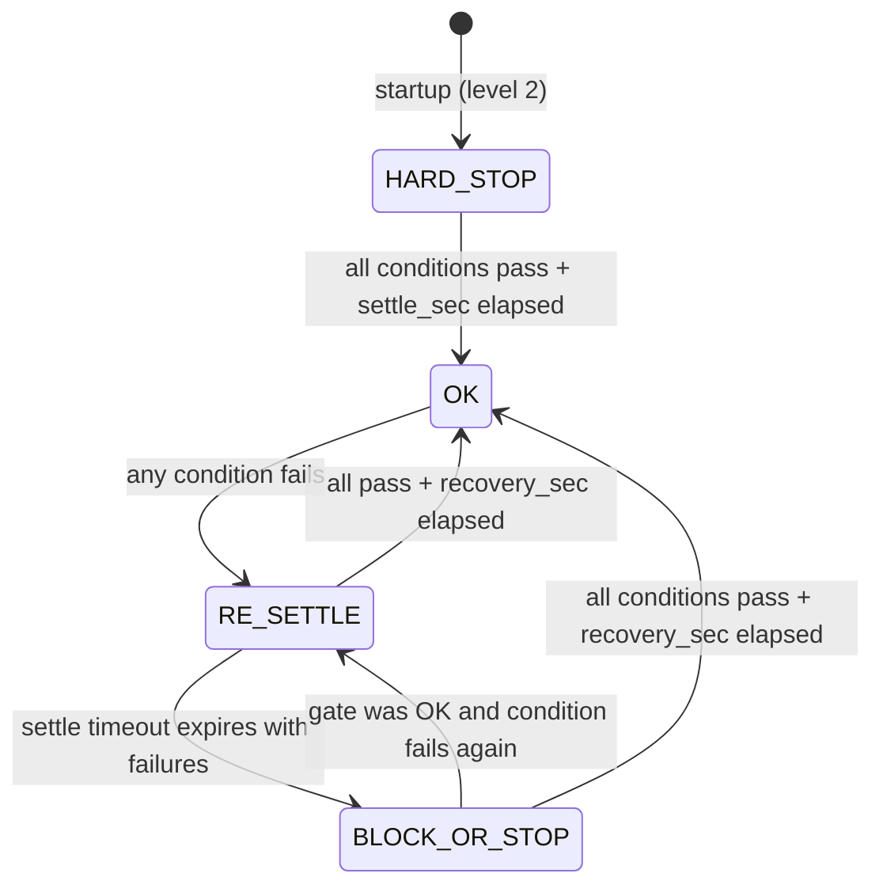

# Recording Gate Node — Lifecycle

## Overview

ROS 2 node that conditionally blocks or allows recording by evaluating a
set of configurable conditions.  Publishes a latched `UInt8` on
`~/gate_level` and per-condition diagnostics on `/diagnostics`.
**Fail-closed design**: the gate starts at level 2 (HARD_STOP) and only
opens once every enabled condition passes and the settle period elapses.

Source: `yubi_core/recording_gate_node.py`
Pure logic: `yubi_core/recording_gate.py`

## Gate Levels

| Level | Name | Meaning |
|---|---|---|
| 0 | OK | All conditions pass — recording allowed |
| 1 | BLOCK_START | Cannot start a new recording |
| 2 | HARD_STOP | Ongoing recording must be stopped immediately |

## Startup Sequence

1. Load config from YAML (default file + optional robot-specific override
   merged via `_deep_merge`).
2. Create latched publisher for `~/gate_level` and diagnostics publisher
   for `/diagnostics`.
3. Set initial state: `gate_level=2`, `settled=False`,
   `settle_is_initial=True`.
4. Instantiate and `setup()` each enabled condition checker.  If
   `debounce_sec > 0`, the checker is wrapped in a `DebouncedChecker`.
5. If no checkers are enabled → immediately set `gate_level=0`,
   `settled=True`.
6. Publish the initial gate level.
7. Start evaluation timer at `eval_rate` Hz.

## Evaluation Loop — `_evaluate()`

Runs at `eval_rate` Hz (default 2 Hz).  Each group is evaluated independently:

1. **Evaluate** all checkers in the group → collect `ConditionResult` list.
2. Identify failing conditions; compute `max_level` (highest escalation
   among failures).
3. **Re-settle trigger**: if the group was at level 0 and any condition
   just failed → reset `settled=False`, record `settle_start_time`, mark
   `settle_is_initial=False`.
4. **Settle logic** (when `settled=False`):
   - Choose timeout: `settle_sec` (initial) or `recovery_sec` (re-settle).
   - If all conditions pass AND elapsed >= timeout → `settled=True`.
   - If elapsed >= timeout AND still failing → force `settled=True` (gate
     stays elevated at the actual failure level); a warning is logged.
5. **Derive group level**:
   - Settled + all pass → **0**
   - Settled + failures → `max_level`
   - Not settled → `max(max_level, BLOCK_START)` (minimum level 1 during
     settle)
6. **Overall gate level**: `max(group.level for group in groups)`.
7. Publish the new gate level and diagnostics.

## Condition Checker Types

| Type | Pass condition | Fail / no-message behaviour |
|---|---|---|
| `topic_condition` | Topic present, fresh, content expression passes, rate above minimum | Per-facet failure with optional escalation overrides (see below) |
| `diagnostics_error_rate` | ERROR count in sliding `window_sec` < `max_errors` | Fail when threshold reached; fail on no message |
| `tf_availability` | All configured TF frame pairs available (optionally fresh) | Fail if `can_transform` returns false or transform too old |

Custom checkers can be loaded by import path: `"module.path:ClassName"`.

Each checker carries an `escalation` level (default 2) that determines how
severely a failure affects the gate.  A checker with `escalation=0` logs
failures but does not block recording.

### TopicConditionChecker

All-in-one topic checker with five evaluation facets (checked in order):

| Facet | Config | Escalation override | Fail reason |
|---|---|---|---|
| Absence | `absence_timeout_sec` (default 0) | `absence_escalation` | Topic not advertised |
| No message | — | — | Subscribed but no message received |
| Single-shot | `single_shot` (default false) | — | Skips freshness + rate after first message |
| Freshness | `timeout_sec` (default 5.0) | — | Message too old |
| Content | `condition` (Python expression) | — | Expression evaluated to falsy |
| Rate | `min_rate_hz`, `rate_window_sec` | `rate_escalation` | Message rate below minimum |

**Special modes:**

- `single_shot: true` — requires exactly one message, then always passes
  (no freshness or rate check). Content expression is still evaluated if
  configured. Useful for latched topics like `/robot_description`.
  Single-shot conditions are **settle-exempt**: they pass/fail immediately
  without blocking or resetting the settle timer (settle only applies to
  periodic conditions like rate and debounce).
- `latch: true` — use transient-local QoS so the subscription receives
  retained messages from publishers. Defaults to `true` when `single_shot`
  is enabled. Can be set independently via global default or per-condition.
- `timeout_sec: -1.0` — inactive-safe: no message, not advertised, and
  stale all return PASS. For topics that only exist during recording
  (e.g. elapsed-time counters for duration limits).
- `reason: "..."` — custom failure reason template using `.format()` syntax.
  Variables: `{msg.*}`, `{condition}`, `{name}`, `{detail}`. If omitted,
  auto-generates with actual values from the message
  (e.g. `"condition failed: not msg.data (msg.data=True)"`).

**Invalidate service** (`~/invalidate`, `std_srvs/Trigger`): destroys all
pooled subscriptions, resets TF buffer, and calls `invalidate()` on each
checker. Checkers re-subscribe on the next eval cycle. Latched subscriptions
re-fetch retained messages. The gate temporarily goes to HARD_STOP and
recovers as topics are re-discovered — equivalent to a soft reboot without
losing configuration.

**Content expressions** are AST-validated at startup.  Only the `msg` variable
is available.  Supported: attribute access (`msg.pose.position.x`), subscripts
(`msg.effort[0]`), comparisons, boolean logic, arithmetic.  Function calls,
imports, and private attributes are rejected.

**Config sanity:** the gate warns at startup if the same topic appears in
multiple conditions within a single group (likely a config mistake).

### Debounce

Any checker can be wrapped with `debounce_sec > 0`.  The condition must
pass continuously for the debounce duration before the gate considers it
passing.  A single failure resets the timer.  Set per-condition or as a
group default (`default_debounce_sec`).

## Diagnostics Publishing

Every evaluation cycle publishes a `DiagnosticArray` on `/diagnostics`:

- **Per-condition**: `recording_gate/{group}/{condition}` — level mapped
  from escalation (OK/WARN/ERROR), message contains the failure reason.
- **Per-group summary**: `recording_gate/{group}` — shows settled state
  and remaining settle time.

All entries have `hardware_id = "recording_gate"`.

## Subscription Deduplication

Multiple checkers on the same topic share a single ROS subscription via
`get_shared_subscription()`.  A `_SubscriptionHandle` fans out messages to
all registered callbacks.  TF checkers share a single `tf2_ros.Buffer` via
`get_shared_tf_buffer()`.

## State Diagram



## Configuration

### Grouped Format (v2)

```yaml
eval_rate: 2.0
settle_sec: 20.0              # initial settle (global default)
recovery_sec: 5.0             # recovery hold (global default)
default_escalation: 2

groups:
  safety:
    settle_sec: 5.0           # override per group
    recovery_sec: 2.0
    default_type: topic_condition
    default_escalation: 2
    default_debounce_sec: 0.0
    conditions:
      estop:
        topic: /runstop_button
        condition: "not msg.data"
        timeout_sec: 5.0
      wireless_stop:
        topic: /wireless_stop
        condition: "not msg.data"
        timeout_sec: 5.0

  health:
    settle_sec: 20.0
    default_type: topic_condition
    default_debounce_sec: 2.0
    conditions:
      joint_states:
        topic: /joint_states
        timeout_sec: 5.0
      head_camera:
        topic: /head_camera/color/image_raw/compressed
        timeout_sec: 3.0
        min_rate_hz: 25.0
        rate_escalation: 1    # low rate blocks start, doesn't hard-stop

  diagnostics:
    default_type: diagnostics_error_rate
    conditions:
      errors:
        topic: /diagnostics_agg
        max_errors: 3
        window_sec: 10.0
        escalation: 1

  tf:
    conditions:
      frames:
        type: tf_availability
        frames:
          - source: odom
            target: base_link
            max_age_sec: -1.0
          - source: base_link
            target: hand_camera
            max_age_sec: 0.5

  duration_limits:
    default_type: topic_condition
    conditions:
      subtask_limit:
        topic: /task_sequence_manager/subtask_elapsed_sec
        condition: "msg.data < 120.0"
        timeout_sec: -1.0
```

### Legacy Flat Format (backward compatible)

A flat `conditions:` key (without `groups:`) is automatically wrapped in a
single `"default"` group.  In legacy format, conditions default to
`enabled: false` (opt-in).

```yaml
eval_rate: 2.0
settle_sec: 30.0
recovery_sec: 5.0

conditions:
  estop:
    type: topic_condition
    enabled: true
    topic: /runstop_button
    condition: "not msg.data"
    timeout_sec: 5.0
    escalation: 2
```

### Config Inheritance

```
global defaults → group defaults → condition config
```

| Level | Keys |
|---|---|
| Global | `settle_sec`, `recovery_sec`, `default_escalation` |
| Group | `settle_sec`, `recovery_sec`, `default_type`, `default_escalation`, `default_debounce_sec`, `enabled` |
| Condition | `type`, `escalation`, `debounce_sec`, `enabled`, plus type-specific keys |
